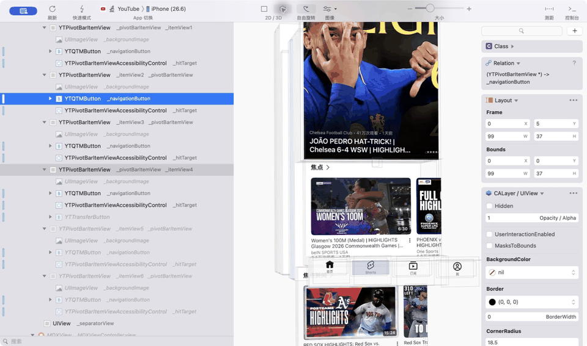
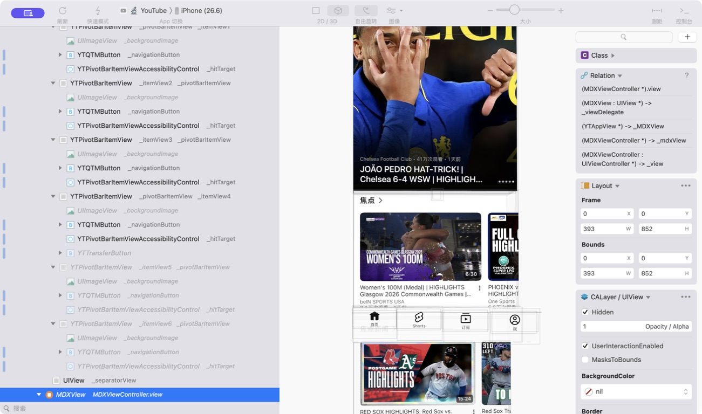
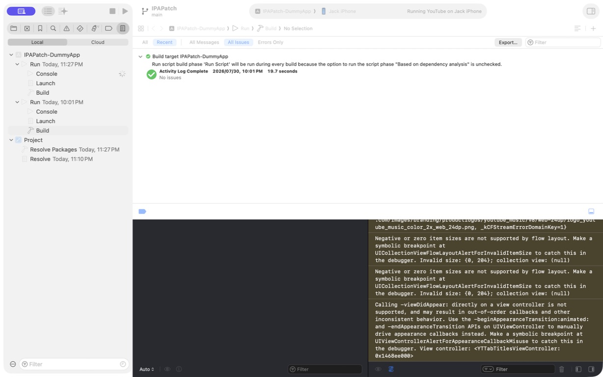
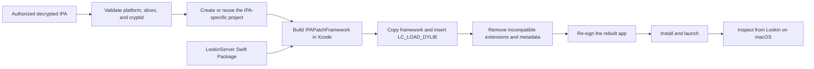

# IPAPatch-Lookin

[](https://github.com/jacklv-coder/IPAPatch-Lookin/actions/workflows/ci.yml)
[](https://github.com/jacklv-coder/IPAPatch-Lookin/releases/latest)
[](LICENSE)

<p align="right">
  <strong>English</strong> | <a href="README.zh-CN.md">简体中文</a>
</p>

Inspect an authorized decrypted iOS app with
[Lookin](https://lookin.work/) from a normal Xcode project.

IPAPatch-Lookin validates the IPA, injects a small framework containing
[LookinServer](https://github.com/QMUI/LookinServer), rebuilds the application
bundle, and re-signs it for a physical device or compatible Simulator.

<p align="center">
  
</p>

> [!IMPORTANT]
> Use this project only with applications you own or are authorized to inspect.
> This repository does not include IPA files, signing certificates, provisioning
> profiles, or code from the demonstrated application.

## Built on IPAPatch

[IPAPatch](https://github.com/Naituw/IPAPatch), created by Wu Tian, is an
open-source Xcode template that rebuilds and re-signs an authorized decrypted
iOS app while injecting custom code, frameworks, and dynamic libraries into
its original `MH_EXECUTE` executable.

IPAPatch-Lookin keeps that injection model and turns it into a focused workflow
for live UI inspection. It adds LookinServer through Swift Package Manager, a
Swift command-line workflow, IPA and Mach-O validation, modern signing cleanup,
automatic App Group redirects, and iOS 26 compatibility. The original project
documentation is preserved in [README_UPSTREAM.md](README_UPSTREAM.md).

## Quick start

Clone the repository and point it at a decrypted IPA:

```sh
git clone https://github.com/jacklv-coder/IPAPatch-Lookin.git
cd IPAPatch-Lookin
./ipapatch-lookin ~/Downloads/YourApp.ipa
```

The command prints a path such as
`Projects/YourApp-a1b2c3d4e5f6/IPAPatch.xcodeproj`. Then:

1. open the printed `IPAPatch.xcodeproj` path;
2. select the `IPAPatch-DummyApp` scheme;
3. choose a compatible iPhone, iPad, or Simulator;
4. select your development team for a physical device; and
5. press `Cmd-R`.

After the patched app launches, open Lookin on the Mac and select the running
app. Its display name is prefixed with `🔬 `.

No Ruby, Bundler, CocoaPods, or `.xcworkspace` is required. LookinServer
`1.2.8` is pinned and resolved with Xcode Swift Package Manager.

You can also type `./ipapatch-lookin ` (including the trailing space) and
drag an IPA from Finder into Terminal.

Each byte-distinct IPA gets its own Git-ignored project under `Projects/`. The
input IPA is copied into that project with an APFS clone when available (and a
normal copy otherwise), so the project remains usable if the original IPA is
moved. Neither generated projects nor IPA files are committed.

## What you get

- an independent Xcode project prepared for each decrypted IPA;
- validation of encryption state, platform, and Mach-O architecture;
- LookinServer embedded in the injected Debug framework;
- automatic removal of extensions and root App Store metadata that cannot be
  re-signed safely;
- sandbox-local redirects for App Groups declared by the original app;
- an iOS 26-safe Lookin screenshot renderer; and
- optional command-line build, install, and launch.

Passing the IPA directly is the most convenient workflow when you want to
choose signing and the destination in Xcode. The explicit `run App.ipa` form
remains available and behaves identically. `deploy` performs the complete
workflow from Terminal.

| Workflow | Command | Result |
| --- | --- | --- |
| Inspect only | `./ipapatch-lookin inspect App.ipa` | Report platform, slices, and encryption state |
| Xcode workflow | `./ipapatch-lookin App.ipa` | Create or reuse an IPA-specific project for manual Xcode Run |
| One-command deployment | `./ipapatch-lookin deploy App.ipa --device DEVICE --team TEAM_ID` | Build, install, and launch |

## Demo

The demo shows a decrypted device build launched on an authorized development
device and inspected through Lookin.

| Live hierarchy inspection | Successful Xcode build |
| --- | --- |
|  |  |

The YouTube interface shown in these images is used solely as a recognizable
technical demonstration. YouTube and Google are not affiliated with this
project, and no YouTube IPA or proprietary code is distributed.

## Requirements

- macOS 13 or newer with Xcode
- the [Lookin macOS app](https://lookin.work/)
- a decrypted IPA you own or are authorized to inspect
- for an `iPhoneOS` IPA:
  - a connected iPhone or iPad running iOS 15.0 or newer;
  - Developer Mode enabled; and
  - an Apple Development signing identity
- for an `iPhoneSimulator` IPA:
  - an installed iOS Simulator runtime; and
  - a Simulator binary slice matching the Mac architecture

Most App Store IPAs are `iPhoneOS` arm64 builds. They can run on a physical
device, not in the Simulator. An arm64 architecture alone does not make an IPA
Simulator-compatible; its Mach-O platform must be `iPhoneSimulator`.

## Use an IPA from `Input/`

Instead of passing a path, place exactly one IPA directly inside the ignored
`Input/` directory:

```sh
cp ~/Downloads/YourApp.ipa Input/
./ipapatch-lookin run
```

The repository tracks only `Input/.gitkeep`. IPA files below `Input/` are
ignored by Git.

## One project per IPA

The direct IPA form and `run` identify an IPA by its SHA-256 digest and create
a thin project at:

```text
Projects/<App-name>-<digest-prefix>/IPAPatch.xcodeproj
```

The generated directory owns its `Input/App.ipa`, resource overrides, bundle
identifier, Xcode project, and `IPAPatchProject.json` manifest. Source code and
build tools are linked to the shared repository, so generating multiple
projects does not duplicate the implementation.

Passing the exact same IPA again reuses its project. A new version, or any
other IPA whose bytes differ, gets a separate project and bundle identifier.
Keep generated projects inside `Projects/`; their shared-code links are
relative to the repository layout.

List all generated projects with:

```sh
./ipapatch-lookin projects
```

## One-time setup and command-line deployment

`setup` resolves the Xcode package and saves reusable local preferences:

```sh
./ipapatch-lookin setup \
  --team ABCDE12345 \
  --bundle-id-prefix com.example.ipapatch \
  --device "My iPhone"
```

After setup, deployment can be reduced to:

```sh
./ipapatch-lookin deploy ~/Downloads/YourApp.ipa
```

For a Simulator IPA:

```sh
./ipapatch-lookin setup --simulator "iPhone 17 Pro"
./ipapatch-lookin deploy ~/Downloads/SimulatorApp.ipa
```

Deployment defaults are stored in the Git-ignored `.ipapatch-lookin.json`.
Setup is optional; the same values can be passed directly to `deploy`. `run`
stores IPA-specific settings in the generated project instead of selecting one
repository-wide IPA.

CLI access to the deployment defaults is coordinated with
`.ipapatch-lookin.json.lock`. Concurrent project generation is serialized with
`.ipapatch-lookin.prepare.lock`.

## Commands

```text
./ipapatch-lookin /path/to/App.ipa
./ipapatch-lookin setup [options]
./ipapatch-lookin inspect /path/to/App.ipa
./ipapatch-lookin run [/path/to/App.ipa]
./ipapatch-lookin projects
./ipapatch-lookin deploy [/path/to/App.ipa] [options]
./ipapatch-lookin devices
./ipapatch-lookin simulators
```

Useful `deploy` options:

| Option | Purpose |
| --- | --- |
| `--team TEAM_ID` | Apple development team for a physical device |
| `--bundle-id BUNDLE_ID` | Exact identifier for the patched app |
| `--bundle-id-prefix PREFIX` | Prefix for a generated identifier |
| `--device NAME_OR_UDID` | Physical device destination |
| `--simulator NAME_OR_UDID` | Simulator destination |
| `--derived-data PATH` | Override the reusable build cache |
| `--build-only` | Build and verify without installing |
| `--no-launch` | Install without launching |

To build and verify a device IPA without signing or connecting a device:

```sh
./ipapatch-lookin deploy /path/to/App.ipa --build-only
```

## Device and Simulator behavior

The direct IPA form and `run` prepare Xcode but do not select or require a
destination. For `deploy`, the behavior is:

| IPA platform | Destination | Signing |
| --- | --- | --- |
| `iPhoneOS` | connected physical iPhone or iPad | Apple Development |
| `iPhoneSimulator` | local iOS Simulator | automatic ad-hoc signing; no team required |

The tool does not convert a device binary into a Simulator binary. Re-signing
or changing Mach-O load commands cannot perform that conversion.

## How it works

Xcode does not link the IPA as a library. The original application remains an
`MH_EXECUTE` Mach-O executable.



Before Xcode builds, the CLI validates the selected IPA's encryption state,
platform, and architecture and generates its independent project. During the
Xcode build:

1. the selected IPA is extracted;
2. Xcode compiles `IPAPatchFramework` with LookinServer in Debug builds;
3. the framework is copied to `Dylibs/IPAPatchFramework`;
4. `optool` adds `@executable_path/Dylibs/IPAPatchFramework` to the original
   executable;
5. the Swift Mach-O normalizer converts the legacy upward-load command into a
   standard `LC_LOAD_DYLIB` and verifies every universal-binary slice;
6. extensions, App Clips, Watch content, and stale root App Store `SC_Info`
   metadata are removed; and
7. the rebuilt bundle is signed, installed, and launched.

The injected framework targets iOS 15.0.

## Analysis compatibility

### App Group redirects

On every build, the patch script reads
`com.apple.security.application-groups` from the input app's code-signing
entitlements. It generates sandbox-local redirects inside the patched app
rather than hardcoding identifiers from a particular vendor in this
repository.

You can override a generated destination or add app-specific defaults in the
generated project's `Assets/Resources/IPAPatchLookinConfig.plist`:

```xml
<key>AppGroupRedirects</key>
<dict>
    <key>group.vendor.original</key>
    <string>IPAPatchLookinAppGroup</string>
</dict>
<key>RedirectUserDefaultsSuites</key>
<true/>
<key>ForcedBooleanDefaults</key>
<dict>
    <key>CloudFeatureRestricted</key>
    <true/>
</dict>
```

These redirects improve authorized UI analysis, but they do not grant the
patched app the original developer's entitlements. Manual mappings take
precedence over generated mappings.

### iOS 26 Lookin screenshots

LookinServer `1.2.8` normally captures some views with
`drawViewHierarchyInRect:afterScreenUpdates:`. On iOS 26 this can raise a UIKit
hierarchy assertion for an otherwise valid app.

IPAPatch-Lookin automatically installs a compatibility renderer that uses
`CALayer.render(in:)`. The Xcode console confirms it with:

```text
[IPAPatch-Lookin] Installed iOS 26 safe screenshot compatibility
```

Some GPU-backed or visual-effect content may have lower screenshot fidelity,
but hierarchy and property inspection remain available.

### Apps that detect LLDB

Some App Store builds terminate themselves when they detect a debugger. The
shared `IPAPatch-DummyApp` scheme therefore launches without attaching LLDB by
default, which is sufficient for Lookin inspection.

Enable **Debug executable** under **Product → Scheme → Edit Scheme → Run →
Info** only when the input app supports LLDB or you specifically need it.

## Troubleshooting

### `Physical device "iPhone" is unavailable`

Project generation does not require a connected device. Pass the IPA again,
open the printed `IPAPatch.xcodeproj`, and select a destination in Xcode.

Use `deploy` only when you want command-line device discovery, building,
installation, and launch.

### `Missing decrypted IPA at .../Assets/app.ipa`

Generate or reuse the IPA-specific project before building:

```sh
./ipapatch-lookin /absolute/path/to/App.ipa
```

Open the project path printed by that command rather than the repository-root
project. The generated project owns its `Input/App.ipa`; moving the original
IPA does not invalidate it. If the generated copy was removed or changed, run
the command again to verify and repair it without replacing project settings.

### `App Extensions must be prefixed with the main bundle identifier`

The patched app uses a new bundle identifier and cannot sign extensions that
still use the original developer's identifier. The build removes embedded
`.appex` directories under `PlugIns/`, `Extensions/`, `AppClips/`, and
`Watch/`, together with root App Store `SC_Info` metadata.

If the error remains:

1. choose **Product → Clean Build Folder** in Xcode;
2. delete the previously patched copy from the device once; and
3. press `Cmd-R` again.

The official App Store installation uses a different bundle identifier and is
not affected.

### App Group entitlement warnings

Messages such as `client is not entitled` are expected when the original app
accesses vendor-owned capabilities. They do not by themselves prove that the
app crashed.

App Group identifiers are redirected automatically when readable entitlements
are present in the IPA. If the decrypted export no longer contains them, add
only the groups required for inspection to the generated project's
`Assets/Resources/IPAPatchLookinConfig.plist`.

`LookinServer - Will launch` confirms that the injected framework started.

### `Terminated due to signal 9`

This is only the debugger's final termination message. Check the preceding
exception and the device crash report. App Group warnings printed earlier are
not sufficient evidence.

If the app stays open when launched directly but terminates after Xcode
attaches, leave **Debug executable** disabled and use Lookin without LLDB.

## Limitations

Re-signing does not transfer the original developer's:

- App Groups or CloudKit containers;
- push environment;
- associated domains;
- Sign in with Apple configuration;
- keychain access groups; or
- server-side authorization.

App extensions, App Clips, and Watch content are removed to simplify signing.
Features that require those capabilities may remain unavailable.

## Responsible use

IPAPatch-Lookin is intended for interoperability research, debugging,
education, and UI analysis of software you are permitted to inspect. You are
responsible for complying with applicable law, licenses, platform terms, and
the application owner's authorization.

Do not commit or distribute third-party IPA files, credentials, provisioning
profiles, account data, or proprietary application code.

## License and attribution

IPAPatch-Lookin is based on
[Naituw/IPAPatch](https://github.com/Naituw/IPAPatch) and retains its MIT
license and copyright notices.

See [LICENSE](LICENSE) and [README_UPSTREAM.md](README_UPSTREAM.md) for
upstream attribution and third-party notices.
