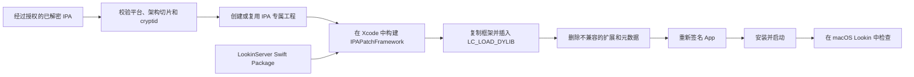

# IPAPatch-Lookin

<p align="right">
  <a href="README.md">English</a> | <strong>简体中文</strong>
</p>

通过一个普通的 Xcode 工程，使用 [Lookin](https://lookin.work/) 检查经过授权且已解密的 iOS App。

IPAPatch-Lookin 会校验 IPA，注入一个包含
[LookinServer](https://github.com/QMUI/LookinServer) 的小型框架，重新构建
App 包，并为真机或兼容的模拟器重新签名。

<p align="center">
  
</p>

> [!IMPORTANT]
> 仅可将本项目用于你拥有或已获得检查授权的 App。本仓库不包含 IPA、签名证书、
> 描述文件，也不包含演示 App 的代码。

## 基于 IPAPatch

[IPAPatch](https://github.com/Naituw/IPAPatch) 由吴天创建，是一个开源的
Xcode 模板。它可以在保留原 App `MH_EXECUTE` 可执行文件的同时，将自定义代码、
Framework 和动态库注入经过授权且已解密的 iOS App，并重新构建和签名。

IPAPatch-Lookin 保留了这套注入机制，并将它封装为专门用于实时 UI 分析的完整工作流。
本项目增加了通过 Swift Package Manager 集成的 LookinServer、Swift 命令行工具、
IPA 与 Mach-O 校验、适配现代签名流程的清理、自动 App Group 重定向及 iOS 26
兼容处理。原项目文档保存在
[README_UPSTREAM.md](README_UPSTREAM.md)。

## 快速开始

克隆仓库，并传入一个已解密的 IPA：

```sh
git clone git@github.com:jacklv-coder/IPAPatch-Lookin.git
cd IPAPatch-Lookin
./ipapatch-lookin ~/Downloads/YourApp.ipa
```

该命令会输出类似
`Projects/YourApp-a1b2c3d4e5f6/IPAPatch.xcodeproj` 的路径。然后：

1. 打开命令输出的 `IPAPatch.xcodeproj` 路径；
2. 选择 `IPAPatch-DummyApp` Scheme；
3. 选择兼容的 iPhone、iPad 或模拟器；
4. 使用真机时选择你的开发者团队；
5. 按下 `Cmd-R`。

修补后的 App 启动后，在 Mac 上打开 Lookin 并选择正在运行的 App。它的显示名称会带有
`🔬 ` 前缀。

项目不需要 Ruby、Bundler、CocoaPods 或 `.xcworkspace`。LookinServer
`1.2.8` 已锁定版本，并通过 Xcode Swift Package Manager 解析。

你也可以在终端输入 `./ipapatch-lookin `（末尾保留一个空格），然后从 Finder
拖入 IPA。

每个内容不同的 IPA 都会在 `Projects/` 下拥有独立且被 Git 忽略的工程。输入 IPA
会优先通过 APFS Clone 复制到工程中，不支持时再使用普通复制。因此即使原 IPA 被移动，
生成的工程仍可使用；生成工程和 IPA 都不会被提交。

## 你会得到什么

- 每个已解密 IPA 对应一个独立的 Xcode 工程；
- 对加密状态、平台和 Mach-O 架构的校验；
- 嵌入注入用 Debug 框架的 LookinServer；
- 自动删除无法安全重新签名的扩展和 App 根目录 App Store 元数据；
- 将原 App 声明的 App Group 重定向到当前沙盒；
- 适配 iOS 26 的安全 Lookin 截图实现；
- 可选的命令行构建、安装和启动流程。

当你希望在 Xcode 中自行选择签名和运行设备时，直接传入 IPA 是最方便的工作流。
原有的 `run App.ipa` 写法仍然保留，行为完全一致。`deploy` 会在终端中执行完整流程。

| 工作流 | 命令 | 结果 |
| --- | --- | --- |
| 仅检查 | `./ipapatch-lookin inspect App.ipa` | 输出平台、架构切片和加密状态 |
| Xcode 工作流 | `./ipapatch-lookin App.ipa` | 创建或复用用于手动运行的 IPA 专属工程 |
| 一条命令部署 | `./ipapatch-lookin deploy App.ipa --device DEVICE --team TEAM_ID` | 构建、安装并启动 |

## 演示

演示中使用经过授权的开发设备运行一个已解密的真机 App，并通过 Lookin 进行检查。

| 实时视图层级检查 | Xcode 构建成功 |
| --- | --- |
|  |  |

图片中的 YouTube 界面仅用于提供易于识别的技术演示。YouTube 和 Google 与本项目
没有关联，本项目也不分发 YouTube IPA 或任何专有代码。

## 环境要求

- macOS 13 或更高版本及 Xcode
- [Lookin macOS App](https://lookin.work/)
- 你拥有或已获授权检查的已解密 IPA
- 对于 `iPhoneOS` IPA：
  - 一台运行 iOS 15.0 或更高版本的已连接 iPhone 或 iPad；
  - 已启用开发者模式；
  - 一个 Apple Development 签名身份
- 对于 `iPhoneSimulator` IPA：
  - 已安装 iOS 模拟器 Runtime；
  - 与当前 Mac 架构匹配的模拟器二进制切片

大多数 App Store IPA 都是 `iPhoneOS` arm64 构建，只能在真机上运行，不能在模拟器
中运行。仅有 arm64 架构并不表示 IPA 兼容模拟器；其 Mach-O 平台必须是
`iPhoneSimulator`。

## 使用 `Input/` 中的 IPA

除了直接传入路径，也可以在已被 Git 忽略的 `Input/` 目录中直接放置唯一一个 IPA：

```sh
cp ~/Downloads/YourApp.ipa Input/
./ipapatch-lookin run
```

仓库只跟踪 `Input/.gitkeep`，`Input/` 下的 IPA 文件会被 Git 忽略。

## 每个 IPA 一个工程

直接传入 IPA 和 `run` 都会使用 IPA 的 SHA-256 摘要识别文件，并在以下位置创建
轻量工程：

```text
Projects/<App名称>-<摘要前缀>/IPAPatch.xcodeproj
```

生成目录独立保存自己的 `Input/App.ipa`、资源覆盖、Bundle Identifier、Xcode 工程和
`IPAPatchProject.json` 清单。源码与构建工具仍链接到共享仓库，因此多个工程不会重复
保存实现代码。

再次传入完全相同的 IPA 会复用已有工程。新版本或任何字节内容不同的 IPA 都会获得
独立工程和 Bundle Identifier。请将生成工程保留在 `Projects/` 下，因为其中指向
共享代码的链接依赖仓库的相对目录结构。

可以列出所有生成工程：

```sh
./ipapatch-lookin projects
```

## 一次性设置与命令行部署

`setup` 会解析 Xcode Package 并保存可复用的本地配置：

```sh
./ipapatch-lookin setup \
  --team ABCDE12345 \
  --bundle-id-prefix com.example.ipapatch \
  --device "My iPhone"
```

设置完成后，部署命令可以简化为：

```sh
./ipapatch-lookin deploy ~/Downloads/YourApp.ipa
```

对于模拟器 IPA：

```sh
./ipapatch-lookin setup --simulator "iPhone 17 Pro"
./ipapatch-lookin deploy ~/Downloads/SimulatorApp.ipa
```

部署默认值保存在被 Git 忽略的 `.ipapatch-lookin.json` 中。`setup` 不是必需步骤，
相同参数也可以直接传给 `deploy`。`run` 会把 IPA 专属配置写入生成工程，不再选择一个
仓库级的共享 IPA。

CLI 通过 `.ipapatch-lookin.json.lock` 协调对部署默认值的访问；并发生成工程则通过
`.ipapatch-lookin.prepare.lock` 串行执行。

## 命令

```text
./ipapatch-lookin /path/to/App.ipa
./ipapatch-lookin setup [options]
./ipapatch-lookin inspect /path/to/App.ipa
./ipapatch-lookin run [/path/to/App.ipa]
./ipapatch-lookin projects
./ipapatch-lookin deploy [/path/to/App.ipa] [options]
./ipapatch-lookin devices
./ipapatch-lookin simulators
```

常用的 `deploy` 选项：

| 选项 | 用途 |
| --- | --- |
| `--team TEAM_ID` | 真机签名所用的 Apple 开发者团队 |
| `--bundle-id BUNDLE_ID` | 修补后 App 的精确 Bundle Identifier |
| `--bundle-id-prefix PREFIX` | 自动生成 Identifier 时使用的前缀 |
| `--device NAME_OR_UDID` | 真机目标 |
| `--simulator NAME_OR_UDID` | 模拟器目标 |
| `--derived-data PATH` | 覆盖可复用构建缓存的位置 |
| `--build-only` | 仅构建和校验，不安装 |
| `--no-launch` | 安装但不启动 |

不签名也不连接真机，仅构建并校验真机 IPA：

```sh
./ipapatch-lookin deploy /path/to/App.ipa --build-only
```

## 真机与模拟器行为

直接传入 IPA 和 `run` 都只准备 Xcode 工程，不会选择或要求运行目标。`deploy` 的
行为如下：

| IPA 平台 | 运行目标 | 签名 |
| --- | --- | --- |
| `iPhoneOS` | 已连接的 iPhone 或 iPad 真机 | Apple Development |
| `iPhoneSimulator` | 本地 iOS 模拟器 | 自动 Ad Hoc 签名，无需开发者团队 |

本工具不会把真机二进制转换成模拟器二进制。重新签名或修改 Mach-O 加载命令无法完成
这种转换。

## 工作原理

Xcode 不会把 IPA 当作动态库链接。原 App 始终保留为 `MH_EXECUTE` Mach-O 可执行文件。



Xcode 构建之前，CLI 会校验所选 IPA 的加密状态、平台和架构，并生成其独立工程。
Xcode 构建过程中：

1. 解压所选 IPA；
2. Xcode 使用 LookinServer 编译 Debug 版本的 `IPAPatchFramework`；
3. 将框架复制到 `Dylibs/IPAPatchFramework`；
4. `optool` 向原可执行文件添加
   `@executable_path/Dylibs/IPAPatchFramework`；
5. Swift Mach-O 标准化工具将旧的 upward-load 命令转换成标准
   `LC_LOAD_DYLIB`，并检查通用二进制中的每一个切片；
6. 删除扩展、App Clips、Watch 内容和 App 根目录中过期的 App Store
   `SC_Info` 元数据；
7. 对重新构建的 App 包进行签名、安装并启动。

注入框架的最低目标是 iOS 15.0。

## 分析兼容性

### App Group 重定向

每次构建时，修补脚本会从输入 App 的签名权限中读取
`com.apple.security.application-groups`。它会在修补后 App 的沙盒内生成本地
重定向，而不是在仓库中写死某个厂商的标识符。

你可以在生成工程的 `Assets/Resources/IPAPatchLookinConfig.plist` 中覆盖自动生成的
目标，或者添加 App 专用的默认值：

```xml
<key>AppGroupRedirects</key>
<dict>
    <key>group.vendor.original</key>
    <string>IPAPatchLookinAppGroup</string>
</dict>
<key>RedirectUserDefaultsSuites</key>
<true/>
<key>ForcedBooleanDefaults</key>
<dict>
    <key>CloudFeatureRestricted</key>
    <true/>
</dict>
```

这些重定向有助于经过授权的 UI 分析，但不会让修补后的 App 获得原开发者的权限。
手动配置的映射优先级高于自动生成的映射。

### iOS 26 Lookin 截图

LookinServer `1.2.8` 通常会使用
`drawViewHierarchyInRect:afterScreenUpdates:` 截取部分视图。在 iOS 26 上，该 API
可能会让原本正常的 App 触发 UIKit 视图层级断言。

IPAPatch-Lookin 会自动安装使用 `CALayer.render(in:)` 的兼容渲染器。Xcode 控制台会
输出：

```text
[IPAPatch-Lookin] Installed iOS 26 safe screenshot compatibility
```

某些 GPU 渲染或视觉效果内容的截图保真度可能较低，但视图层级和属性检查仍然可用。

### 会检测 LLDB 的 App

部分 App Store 构建在检测到调试器时会主动终止。共享的 `IPAPatch-DummyApp`
Scheme 默认启动时不附加 LLDB，这足以用于 Lookin 检查。

只有当输入 App 支持 LLDB，或你确实需要调试器时，才在
**Product → Scheme → Edit Scheme → Run → Info** 中启用
**Debug executable**。

## 故障排查

### `Physical device "iPhone" is unavailable`

生成工程不要求连接真机。重新传入 IPA，打开输出的 `IPAPatch.xcodeproj`，然后在
Xcode 中选择运行目标。

只有需要从命令行完成设备发现、构建、安装和启动时才使用 `deploy`。

### `Missing decrypted IPA at .../Assets/app.ipa`

构建之前，先生成或复用 IPA 专属工程：

```sh
./ipapatch-lookin /absolute/path/to/App.ipa
```

请打开该命令输出的工程路径，而不是仓库根目录的工程。生成工程会保存自己的
`Input/App.ipa`，移动原 IPA 不会使它失效；如果生成副本被删除或更改，请重新执行命令
校验并修复它，已有工程设置不会被替换。

### `App Extensions must be prefixed with the main bundle identifier`

修补后的 App 使用新的 Bundle Identifier，无法签名仍属于原开发者 Identifier 的
扩展。构建过程会删除 `PlugIns/`、`Extensions/`、`AppClips/` 和 `Watch/` 下嵌入的
`.appex` 目录，同时删除 App 根目录的 App Store `SC_Info` 元数据。

如果错误仍然存在：

1. 在 Xcode 中选择 **Product → Clean Build Folder**；
2. 从设备上删除之前安装的修补版本；
3. 再次按下 `Cmd-R`。

官方 App Store 安装使用不同的 Bundle Identifier，不会受到影响。

### App Group 权限警告

当原 App 访问属于其厂商的能力时，出现 `client is not entitled` 等日志是正常的。
这些日志本身不能证明 App 已经崩溃。

如果 IPA 中仍有可读取的签名权限，工具会自动重定向 App Group 标识符。如果解密导出
文件中已不再包含这些权限，只需将分析所需的 App Group 添加到生成工程的
`Assets/Resources/IPAPatchLookinConfig.plist`。

`LookinServer - Will launch` 表示注入框架已经启动。

### `Terminated due to signal 9`

这只是调试器报告的最终终止信息。请检查此前的异常和设备崩溃报告；更早出现的 App
Group 警告不足以说明终止原因。

如果 App 直接启动时保持运行，但在 Xcode 附加后终止，请关闭
**Debug executable**，并在不使用 LLDB 的情况下通过 Lookin 检查。

## 限制

重新签名不会转移原开发者的以下能力：

- App Group 或 CloudKit Container；
- 推送环境；
- Associated Domains；
- Sign in with Apple 配置；
- Keychain Access Group；
- 服务端授权。

为了简化签名，App 扩展、App Clips 和 Watch 内容会被移除。依赖这些能力的功能可能
仍不可用。

## 合理使用

IPAPatch-Lookin 仅用于互操作性研究、调试、教育以及对已获授权软件的 UI 分析。你有
责任遵守适用法律、许可证、平台条款及 App 所有者的授权范围。

请勿提交或分发第三方 IPA、凭据、描述文件、账户数据或专有 App 代码。

## 许可证与鸣谢

IPAPatch-Lookin 基于 [Naituw/IPAPatch](https://github.com/Naituw/IPAPatch)，
并保留其 MIT 许可证与版权声明。

上游项目的完整鸣谢及第三方声明请参阅 [LICENSE](LICENSE) 和
[README_UPSTREAM.md](README_UPSTREAM.md)。
